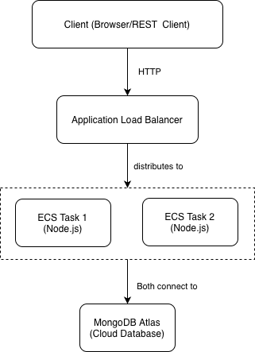

# ClimateAction Hub API

A RESTful API for a climate action community forum, built with Node.js, Express.js, and MongoDB, deployed on AWS ECS.

## Features

- User registration and login with JWT authentication
- Bcrypt password hashing
- Forum post and comment CRUD operations
- Role-based access control (only authors can edit/delete their content)
- Containerized with Docker, deployed on AWS ECS Fargate
- Auto-scaling based on CPU utilization

## Tech Stack

Node.js · Express · MongoDB · Mongoose · JWT · Docker · AWS ECS · AWS ECR

## API Endpoints

### Authentication

| Method | Endpoint       | Auth | Description       |
| ------ | -------------- | ---- | ----------------- |
| POST   | /auth/register | No   | Register new user |
| POST   | /auth/login    | No   | Login and get JWT |

### Posts

| Method | Endpoint   | Auth              | Description   |
| ------ | ---------- | ----------------- | ------------- |
| GET    | /posts     | No                | Get all posts |
| GET    | /posts/:id | No                | Get a post    |
| POST   | /posts     | Yes               | Create a post |
| PUT    | /posts/:id | Yes (author only) | Update a post |
| DELETE | /posts/:id | Yes (author only) | Delete a post |

### Comments

| Method | Endpoint                    | Auth              | Description                |
| ------ | --------------------------- | ----------------- | -------------------------- |
| GET    | /posts/:postId/comments     | No                | Get all comments of a post |
| POST   | /posts/:postId/comments     | Yes (author only) | Create a comment           |
| DELETE | /posts/:postId/comments/:id | Yes (author only) | Delete a comment           |

### Users

| Method | Endpoint   | Description   |
| ------ | ---------- | ------------- |
| GET    | /users     | Get all users |
| GET    | /users/:id | Get a user    |
| POST   | /users     | Create a user |

## Error Responses

Errors are returned as JSON with an `error` message and an appropriate HTTP status code, for example:

```json
{
  "error": "Post with id 123 not found"
}
```

## Run Locally

npm install
npm run dev

## Create .env file
cp .env.example .env
Fill in your MongoDB URI and JWT_SECRET

## Run with Docker

### Start all services

docker-compose up --build

### Stop all services

docker-compose down

## Deployment

Deployed on AWS ECS (Fargate) with MongoDB Atlas.

### Architecture

- Runtime: Node.js 18 on AWS ECS Fargate
- Database: MongoDB Atlas
- Container Registry: AWS ECR
- Region: us-west-2



### Live API

Base URL: http://35.88.52.84:3000
